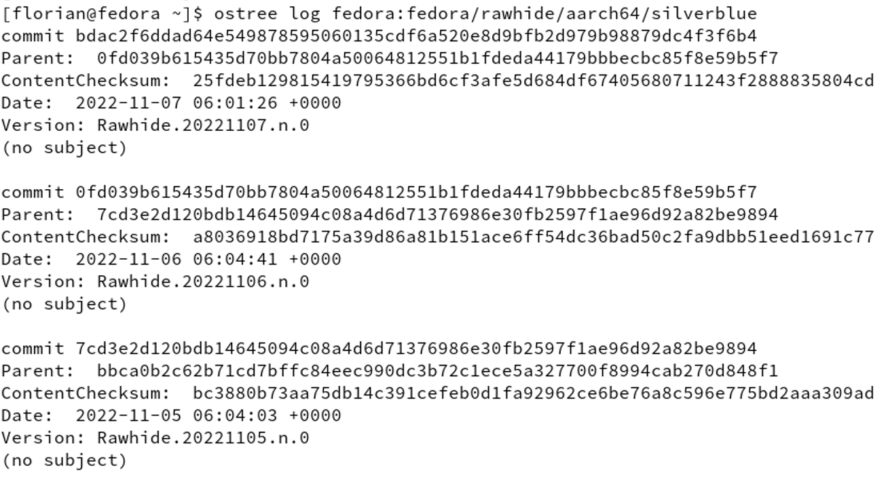
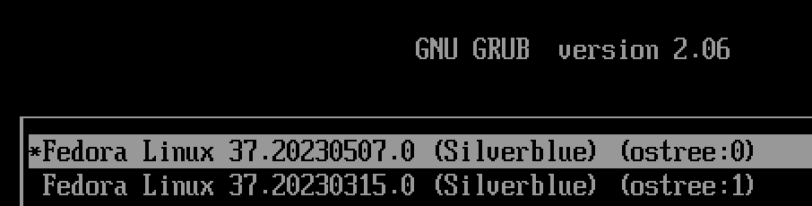
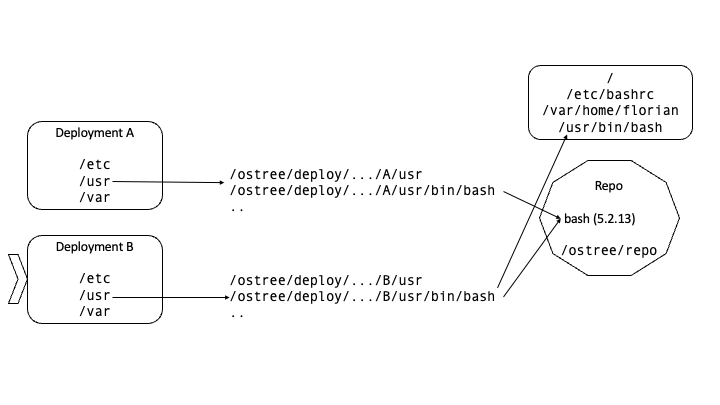
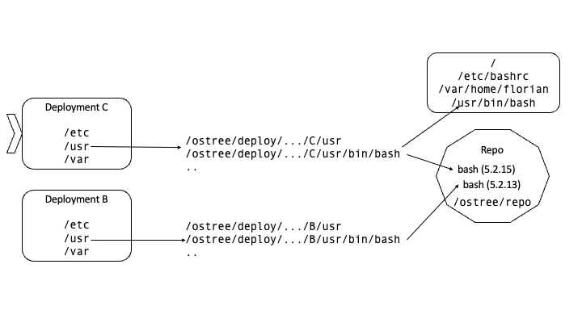

> This post is part of a blog post series on my Garden Linux fellowship. \
> The next entry in the series is [todo](todo).

I have been working as a developer on the [SAP Cloud SDK team](https://sap.github.io/cloud-sdk/) for almost six years now, during which I have learned a great deal from various projects involving diverse technologies.

One non-Cloud SDK thing that really caught my interest in the last year are Linux-related topics.
In our team, we value learning a lot, and one way how this manifests is that we can take time on Fridays to work on non-project related learnings.
In this time, I looked into how [Linux-containers work under the hood](https://github.com/fwilhe2/containers-knowledge-base) (Control Groups, Namespaces), I peeked into [eBPF](https://ebpf.io/) which allows to make sandboxed Linux kernel modules and I looked into immutable image-based linux systems based on [OSTree](https://ostreedev.github.io/ostree/).

At SAP, we have a program called 'fellowship', which allows employees to work within different teams or roles for a specified period without having to change jobs permanently. It's an excellent opportunity for exploring new technologies and meeting new people in a large company like SAP. That is why I decided to pursue a fellowship to learn more about a topic I'm passionate about.

I'm excited to share that I will be joining the **Garden Linux** team for the next six months!
It turns out that immutable image-based operating system is a subject the Garden Linux team is interested in.

During my fellowship, the primary project will be to **Prototype an Immutable Image-Based Operating System based on Garden Linux**. In this blog post series, I will share my progress, discussing what I've tried and learned. Starting with the basics in this post, I will aim to provide updates on a monthly basis.

## What is Garden Linux

[Garden Linux](https://gardenlinux.io/) is based on [Debian GNU/Linux](https://www.debian.org/) and intended to be the best Linux system to run [Gardener](https://gardener.cloud) nodes.

It's an open source project and not a commercial offering by SAP.
Garden Linux can be used for other purposes than running Gardener nodes.

I'm still getting the hang of what Garden Linux does and how it functions. Before starting my fellowship, I did experiment a bit with the build process and was able to create images and boot them on both virtual and physical hardware. As I continue to learn more, my understanding of Garden Linux will undoubtedly improve.

## What are "immutable image-based operating systems"?

Traditional Linux-based systems use packages, usually in the `deb` or `rpm` format.
These packages are archives containing the application, documentation, and setup scripts.
For instance, when you install a web server program on your Linux machine, some files – including the program itself, any required shared libraries, documentation, and scripts – will be copied to your root filesystem.
The package may also execute scripts during installation and uninstallation, like setting up a specific user for the web server to run under.

Traditional package-based systems make it difficult to assess the state of your machine sometime after the installation. You can use configuration management tools like Ansible or Puppet to set up an initial state and, to some degree, maintain that state. But this method has limitations and there is always the possibility of manual modifications being made without the configuration management system.
An alternative method for building Linux-based systems is image-based, as opposed to package-based. If you're familiar with Docker/OCI images, you already have a good understanding of what this entails.

## What is OSTree

[OSTree](https://ostreedev.github.io/ostree/) is a tool that functions similar to git but specifically for operating system images. As a developer, you can think of it as having your entire OS work like a git repository, allowing you to `pull` updates or `revert` in case of issues. While it's more complicated than that, git provides a helpful mental model for understanding what OSTree does.

Developed by Red Hat, OSTree is the foundation for Fedora-based systems, such as [CoreOS](https://docs.fedoraproject.org/en-US/fedora-coreos/). OS updates are installed by pulling a new image and rebooting the system. These new images can be delivered as often as needed – Fedora, for example, does this daily.

In contrast to git, when setting up an OSTree-based system you won't get all the previous commit history.
In a newly installed system you will only have one commit, and you will get new commits as time goes by but the system will also discard older commits.
You can view existing commits in the cli, which does look quite similar to git.

<!-- ostree-log.png  -->

Each new *commit* creates a new *deployment* on the local computer.
Deployments can be selected at boot time like in this example:

<!-- ostree-boot-deployments.png  -->

On boot, the currently selected deployment is used for the root filesystem.
Since most files won't change between deployments, the file exists only once on the local hard drive.

Consider the following example where we have two Deployments, `A` and `B`.
Both deployments contain the same version of `bash`, so the binary file exists only once.
We're booted into the newer deployment `B`, the older `A` is still available as a fallback.

<!-- ostree-deployment-repo-1.png  -->

Now a new deployment `C` becomes available which replaces the older `A` deployment.
`C` contains a newer version of `bash`.
Since the `B` deployment is still available on the machine, we now have the `bash` binary in two versions on our machine.

<!-- ostree-deployment-repo-2.png -->

Bash version `5.2.13` will disappear from our system once a new deployment `D` exists which will replace deployment `B`.

This approach always allows to revert an update in case it has any regressions.

An alternative approach to reach similar qualities [may require two boot partitions](https://ostree.readthedocs.io/en/stable/manual/related-projects/#chromiumos-updater).
But the image-based approach implemented by OSTree also provides more confidence that clients don't diverge from the 'golden image' as the system is (mostly) immutable.

Operating system images can be provided by general-purpose distributions like Fedora or by specialized distributions like Garden Linux. In OSTree-based systems, you can't just run `apt-get install apache2` since the system is designed to be immutable.

Software can be added to OSTree-based systems in various ways, the recommended option if possible is to run additional software in containers.
So if you wanted to run the Apache HTTP server on an OSTree-based system, you'd run it in a container instead of installing it.

OSTree caters to several use cases, with the most prominent being the Internet of Things (particularly the automotive industry¹) and cloud infrastructure (which is where Gardener comes into play).

¹: Examples are [HERE OTA Connect](https://docs.ota.here.com/ota-client/latest/ostree-and-treehub.html) and [TorizonCore](https://developer.toradex.com/torizon/in-depth/ostree/).

## How Could OSTree be useful in the Context of Garden Linux?

It is not clear yet if adopting OSTree would actually provide benefits to Garden Linux.
Answering this question is one of the main goals of my fellowship project.

Also, I will be keeping my eyes open for other tools that might help with making a good immutable Garden Linux system.

## What Could be Potential Outcomes of the Project?

Firstly, I'm working on developing a bootable Garden Linux version based on OSTree that can operate on bare metal, virtualization platforms, and cloud provider environments.

Additionally, I'm focused on automating the process of image building and ensuring that existing systems can be updated by fetching new image versions.

I'm also researching various methods to help integrate Garden Linux's "feature" system with OSTree-based systems, with the intention of implementing the most suitable option.

Lastly, I'm exploring different approaches to minimize or eliminate the need for a reboot whenever possible, as this is a wish by the Garden Linux team.

I'll keep you updated on my progress in this blog post series.

If you're interested in the topic, feel free to comment this blog post or reach out to me on [LinkedIn](https://www.linkedin.com/in/fwilhe/).
