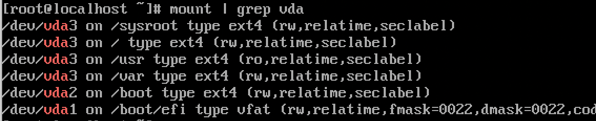

The first few weeks of my fellowship in the Garden Linux have already passed, and as promised I'd like to reflect on and share my experiences with you.

> This post is part of a blog post series on my Garden Linux fellowship. \
> See the [introductory post for context](https://blogs.sap.com/2023/07/10/making-an-immutable-image-based-operating-system-out-of-garden-linux/).

To recap, what I want to achieve during the Fellowship is to build an immutable image-based OSTree system with Garden Linux.

The first milestone in reaching this goal is to get a Garden Linux system to boot with OSTree.
This does not need to be elegant, I just want to see it work so we can identify what needs to be done do it properly.

This sounds easier than it is.

## First contact with OSTree

Making an initial OSTree repository is quite simple, I've done that in the past and I've even contributed the [OSTree tl;dr page](https://github.com/tldr-pages/tldr/blob/main/pages/linux/ostree.md) to the [tldr-pages](https://tldr.sh/) project.
Side-note: If you don't know tldr-pages, check it out, it's a great resource for looking up how to use cli tools. I use it on a daily basis.

But building a bootable system with OSTree is much more complex.

There are high level tools available, such as [osbuild](https://www.osbuild.org), and building images based on existing manifests such as the [CentOS Automotive SIG sample images](https://gitlab.com/CentOS/automotive/sample-images) is quite trivial.

This will give you a pretty minimal CentOS virtual machine to play around with.
You can add extra packages to the image and you can use `rpm-ostree` to install packages on the running system.

Nice! But how can I reproduce something like this with Garden Linux?

Garden Linux is based on Debian, not CentOS.
All the official OSTree documentation is based on Fedora and CentOS, and there is no official documentation on how to build an OSTree-based Debian system.

There are a few scripts on GitHub for building OSTree-based Debian systems, but they are not actively maintained and I was not able to get them to work.

But even if this was successful, it would not have fully solved my problem as Garden Linux does have a few differences to a 'standard' Debian install.

The key differences between Garden Linux and a 'standard' Debian install are:

- Garden Linux uses [systemd-boot](https://www.freedesktop.org/software/systemd/man/systemd-boot.html) instead of GRUB as the bootloader
- Garden Linux uses [dracut](https://github.com/dracutdevs/dracut/wiki) instead of [initramfs-tools](https://wiki.debian.org/initramfs-tools) for the initramfs
- Garden Linux has a very minimal set of packages available in it's repositories, focussing on it's purpose
- Garden Linux has its own [containerized builder](https://github.com/gardenlinux/builder), allowing to build customized Garden Linux systems easily

As someone who was not involved in making those decisions, I think they show a lot of pragmatism.
Debian is a rock solid base operating system that is being developed by an open source community and supported by a non profit organization.
Garden Linux takes this foundation and swaps out parts that make sense for it's purpose.
And it is available to the public, as open source software, allowing anyone to use it for their own purposes.

Because I could not find a OSTree builder that would work with Garden Linux, I decided to start from scratch.

## Building a Garden Linux OSTree system

The goal was to get a Garden Linux system booting using OSTree, somehow.

The first bummer was that OSTree does need integration with the bootloader, but [systemd-boot is not yet supported](https://github.com/ostreedev/ostree/issues/1719).

So I decided to use GRUB for now, and switch to systemd-boot later.
After about two weeks, this turned out as an dead end.
I could not get a booting system with GRUB and OSTree.

Interestingly enough I learned about [BLS, the Boot Loader Specification](https://uapi-group.org/specifications/specs/boot_loader_specification/), which is a standardized way of booting Linux systems.

OSTree does generate BLS entries, and with that a system can boot without an extra bootloader.

This does not look too bad.

But it does not boot successfully.
I've had various issues while trying to boot this deployment, and I'll get to them later.

First, we need to investigate a question that became ever more apparent as I've continued my journey.

## Well, how does Linux boot anyway?

This question took me down an interesting rabbit hole.

I have to clarify that we are only looking at UEFI-based systems here, and only at systemd-boot or the UEFI bootloader.

UEFI systems have a small FAT partition, the [EFI System Partition](https://en.wikipedia.org/wiki/EFI_system_partition).
This contains an executable file in the _PE_ format (actually, that's a Windows executable, regardless of the Operating System you are booting).

The bootloader is started by the UEFI firmware, and the bootloader then loads the kernel and the initramfs.
The initramfs is a small filesystem that contains the initial root filesystem and the init system, in most modern Linux systems this is systemd.
The init system then mounts the real root filesystem and switches to it.

This is a simplified flowchart of the boot process:

OSTree needs a modified boot procedure.
For this, it includes a program that is being packaged in the initial ramdisk.
This program is called `ostree-prepare-root` and it is responsible for mounting the OSTree root filesystem.

During the boot process, orchestrated by systemd, the `ostree-prepare-root` program is called and does what's needed by OSTree.

This is where the `ostree=` kernel parameter is needed to find the deployment root.
The deployment root needs to be mounted at `/`.
This is how OSTree allows us to revert the whole filesystem to an earlier version, if needed.
I have already [shown how we can select OSTree deployments at boot time in the first post of this series](https://blogs.sap.com/2023/07/10/making-an-immutable-image-based-operating-system-out-of-garden-linux/).

The process is described in a [code comment in ostree-prepare-root](https://github.com/ostreedev/ostree/blob/f44909f8a2ed084da241a9f241376b9b5ef98be7/src/switchroot/ostree-prepare-root.c#L30).

Accounting for the OSTree specific changes, this is how our flowchart looks like now:

We can also observe this in the journal of our CentOS OSTree system.

Once the system is booted, we can have a look at the mounted filesystems.
Ha, that's unusual.
We have three partitions, so far so expected.
We have the efi partition as described above.
We have a separate boot partition which contains the kernel and the initramfs.
And we have a root partition which is mounted multiple times with different mount options.
This is what gives us the properties of the OSTree system, where `/usr` is read-only and `/etc` is read-write.

## Current status and next steps

During the last three weeks, I've made a lot of progress.

I've spent quite some time debugging, looking into the source code of OSTree, comparing my Garden Linux system to the CentOS system, analyzing the build logs of the CentOS vm, even injecting my own dracut module into the initrd for debugging purposes.

Over time, I've fixed errors in my build script as I discovered them.

Since we learn from errors, let's have a look at some of them:

- I did screw up the [links in the root fs](https://ostreedev.github.io/ostree/adapting-existing/#system-layout)
  - Somehow I managed to create a cyclic link from `/sysroot/ostree` pointing to `/sysroot/ostree`
  - I'm still not sure if I got the relation between the `sysroot`, `repo` and `ostree` directories right, this lead to multiple failed attempts to build and boot the system
- I had wrong parameters in the ostree deploy command leading to invalid BLS entries

I have to admit that creating a bootable OSTree system is harder than I anticipated, and both the documentation and the existing build scripts were hard to understand for me at times.
I did open an [issue in the ostree repo](https://github.com/ostreedev/ostree/issues/2964) about the documentation, let's see if I can contribute something to that after my own understanding has improved.

It feels like I'm close to reaching the first milestone, a minimal bootable Garden Linux system based on OSTree, but I'm not there yet.

I'll keep you updated on my progress in this blog post series.

## Pick of the month

I've came across [this blog post by Colin Walters](https://blog.verbum.org/2020/08/22/immutable-→-reprovisionable-anti-hysteresis/), the maintainer of OSTree.
The article is a bit long, but I think it is the most comprehensive explanation of the benefits of immutable image-based systems I've read so far.
I highly recommend reading it.

> If you're interested in the topic, feel free to comment this blog post or reach out to me on [LinkedIn](https://www.linkedin.com/in/fwilhe/).
