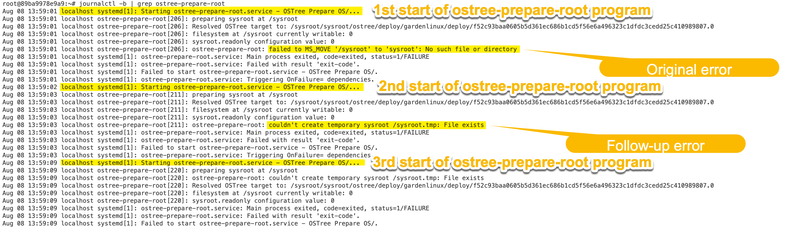
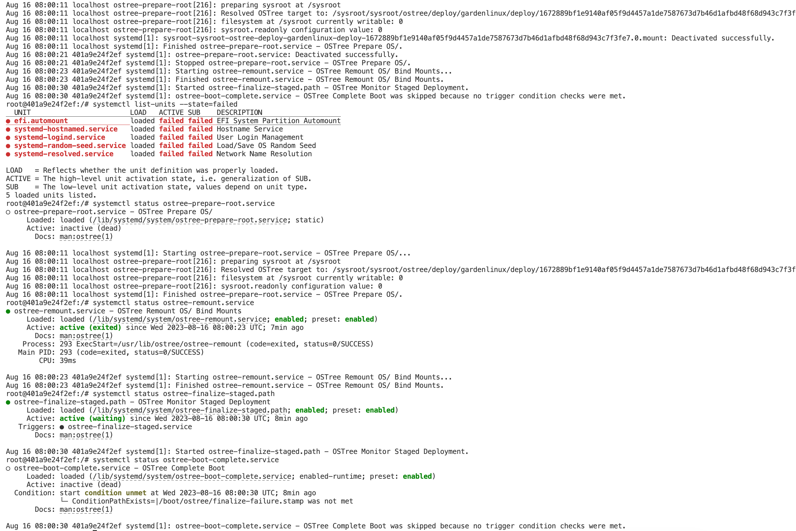

<!-- Title: The chase is better than the catch -->

> This post is part of a blog post series on my Garden Linux fellowship. \
> See the [introductory post for context](https://blogs.sap.com/2023/07/10/making-an-immutable-image-based-operating-system-out-of-garden-linux/).

My [last blog post](https://blogs.sap.com/2023/08/07/onboarding-to-the-garden-linux-team-getting-hands-dirty-with-ostree/) ended with an error message saying that `/sysroot.tmp` could not be created.

This error is a good example for how a follow up error can lead you on the wrong trace for finding the root cause of an issue.

Looking at the proper logs, we can identify a pattern: The program that is being run is `ostree-prepare-root`.
It fails and is automatically restarted multiple times by systemd.

The `/sysroot.tmp` error starts to appear at the second invocation.
This shows us the original error

```
failed to MS_MOVE '/sysroot' to 'sysroot': No such file or directory
```



We did not see this in last month's blog post, because `systemctl status` does only show the most recent program execution.

Instead, it seems to be required to manually create the `sysroot` directory inside the deployment folder.

To understand this, I needed to look into the source code of `ostree-prepare-root`.
I've created a flowchart of the relevant part of the program.
The program is actually much more complex than this flowchart implies, but this shows what's going wrong: The program constructs a `deploy_path`, uses this as the current working directory and then tries to mount the `sysroot` directory.
This fails because the `sysroot` directory does not exist.


I find it a bit weird that this directory is not created by the `deploy` command, as it does create all the other directories that are required for a deployment.
I've asked for clarification in an [issue in the OSTree github repo](https://github.com/ostreedev/ostree/issues/2983), but it seems to be as intended.
Good enough for me.

With this issue resolved, we find the next problem when trying to boot into our image: systemd can't find `init`.


This error initially was hidden.
It does get only visible once you append `systemd.journald.forward_to_console=1` to the kernel command line as documented on the [systemd website](https://freedesktop.org/wiki/Software/systemd/Debugging/).
I found this option very helpful in cases where boot issues prevent me from getting a working shell.
Over the last few weeks, I did multiple times get into a loop while booting which did not give me a working shell.

I did stumble over the language here as I was not sure what 'chase' means in that context.
Turns out, this is [systemd's term](https://github.com/systemd/systemd/blob/a67e5c6e371f3a3facd2d2d0d636d335f662c0ae/src/basic/chase.c#L553) for finding files.

> The chase is better than the catch

Weird. systemd is our init, so why does it look for `/sbin/init`?

We can see in the log that this comes from the `initrd-switch-root` service.
This is part of systemd, not of OSTree.

Consider this very simplified view of the boot process.
OSTree has a 'prepare root' service, which is the one we discussed before.
This does a bunch of mounts and prepares the system so that systemd can do its own switch root.
And now we're failing in the systemd switch root.


I've discovered that in my CentOS OSTree system, the same service is running, but the `systemctl switch-root` command does get another argument: `/sysroot`.
This seems to be required, but does not yet fix our problem.

Turns out, I was missing a link from `/lib` to `/usr/lib`.
This is part of a thing called [usr merge](https://www.freedesktop.org/wiki/Software/systemd/TheCaseForTheUsrMerge/) which is a concept in modern linux distributions.
While technically not being strictly required for OSTree, doing the user merge makes it easier to setup a system.

After fixing this, we do get into a booting system, but it does still show errors at boot.


Despite the errors, we can login and get a somewhat working system.



Upon investigation, we see multiple errors.

Way too many file-system mounts are read-only.
The fix seems to be to start the system with the `rw` kernel parameter.
This gives us a much more sensible system, where the important read-only filesystem mount on the `/usr` directory is still read-only, as expected.

I guess it should be possible to boot the system with the `ro` kernel parameter, but I did not investigate this any further.

Our `/var` directory is missing some entries such as `/var/home`, `/var/roothome`, `/var/opt` and others.
That's why we get a message about the missing home directory when we get our login shell.
They are part of our original root file system, but not part of the OSTree deployment.
This can also be fixed by manually creating the missing directories.
Now, if we login, we get our home directory and it's writable, as expected.

Another issue is that a handful of systemd services fail because they don't expect a read-only filesystem.
Since I'm not sure how to fix this just now, I've decided to disable the services for now.
This is not a proper solution, but it allows us to continue with the next steps.

After those tweaks, we do get a system that boots just fine.


The mounts look good to me, and systemctl does report the system as `running`.

Hooray, the first big milestone is reached.

Adding podman to the image allows us to run software in containers.
As 'installing' software in the traditional sense is not possible in image-based systems, having a container runtime is vital.
Adding podman turns out to be trivial using the Garden Linux builder.

# OSTree glossary

When working with OSTree, it is easy to get confused by the different terms used in the documentation and code.
Here is a list of terms that I found useful to keep in mind:

| Term                   | Description                                               | Example Value                                                     |
| ---------------------- | --------------------------------------------------------- | ----------------------------------------------------------------- |
| _stateroot_ (_osname_) | identifier for the os                                     | "debian", "fedora", "gardenlinux"                                 |
| _root mountpoint_      | constant value                                            | `/sysroot`                                                        |
| _deployment checksum_  | sha256 checksum of the whole root-fs (all files)          | `730e109b...`                                                     |
| _boot checksum_        | sha256 checksum of the kernel + initrd files              | `619cba8e...`                                                     |
| _ostree target_        | ostree kernel parameter, provided in the bootloader entry | `ostree=/ostree/boot.N/osname/BOOT_CHECKSUM/0`                    |
| _dest path_            | root mountpoint + ostree target (symbolic link)           | `/sysroot//ostree/boot.N/osname/BOOT_CHECKSUM/0`                  |
| _deploy path_          | target where dest path link points to                     | `/sysroot/ostree/deploy/gardenlinux/deploy/DEPLOYMENT_CHECKSUM.0` |

## Next steps

Now that we have a running prototype, we can look into the next steps.

### Improve the prototype

Our working prototype still has quite a few very rough edges, such as

- Podman can't be used in rootless mode (by a non-root user, without the use of sudo)
- We deactivated some systemd services that failed due to read-only mounts, we need to investigate how to fix those properly
- So far we've only tested in local qemu/kvm virtual machines, none of the cloud providers is tested yet

I'm sure there are more issues that I'm not aware yet.

### System update

We can boot a system, but we can't update it yet.
For that, we need to build OSTree repositories and serve them via HTTP.
OSTree can _pull_ new _commits_ (like git).
A new _commit_ can become a new _deployment_ which we can boot into.

### Layering of features

Since we don't have a package manager available in image-based systems, some other solution is needed.
For Red Hat's operating systems, [rpm-ostree](https://coreos.github.io/rpm-ostree/) is available.
As Garden Linux is based on Debian which does not use the RPM package format, we need to look for some other solution.

## Pick of the month

[Write about what you learn. It pushes you to understand topics better.](https://addyosmani.com/blog/write-learn/) is a blog post by Addy Osmani that kind of describes why I chose to write about what I'm doing in this project.
By committing to write about it in public, I hold myself accountable.
I think writing does also have a value if you're only doing it for yourself, but the commitment of publishing posts does help me to stay focused.

But I do also hope that my posts are useful for others and might help to understand how OSTree works.

> If you're interested in the topic, feel free to comment this blog post or reach out to me on [LinkedIn](https://www.linkedin.com/in/fwilhe/).
