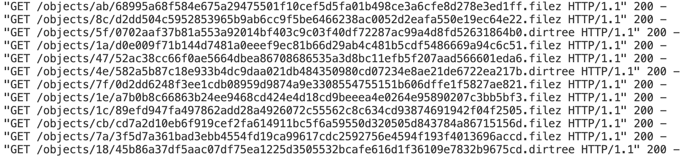
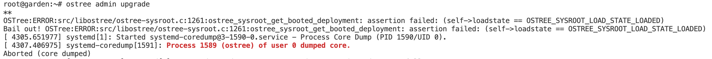
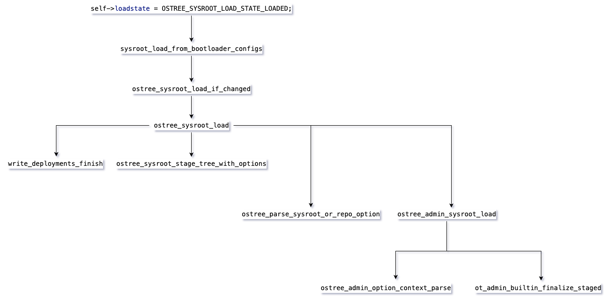
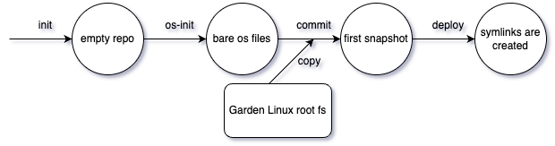
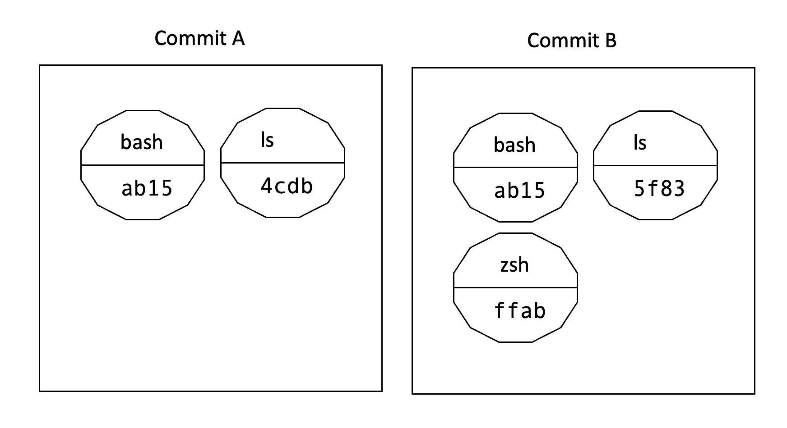
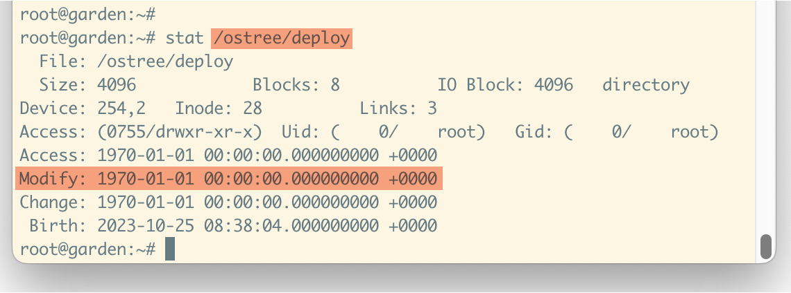
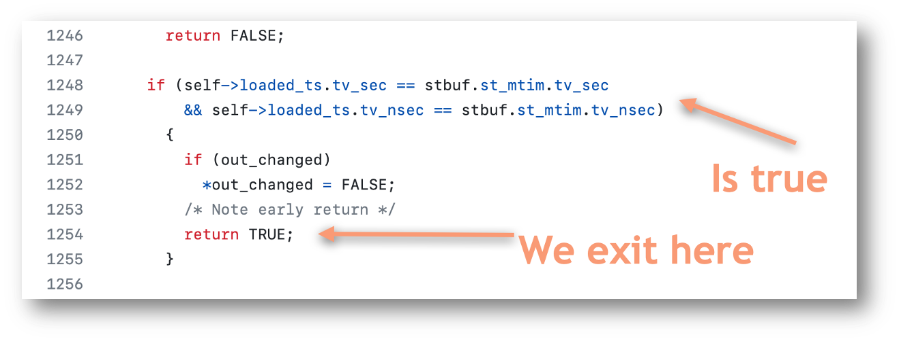
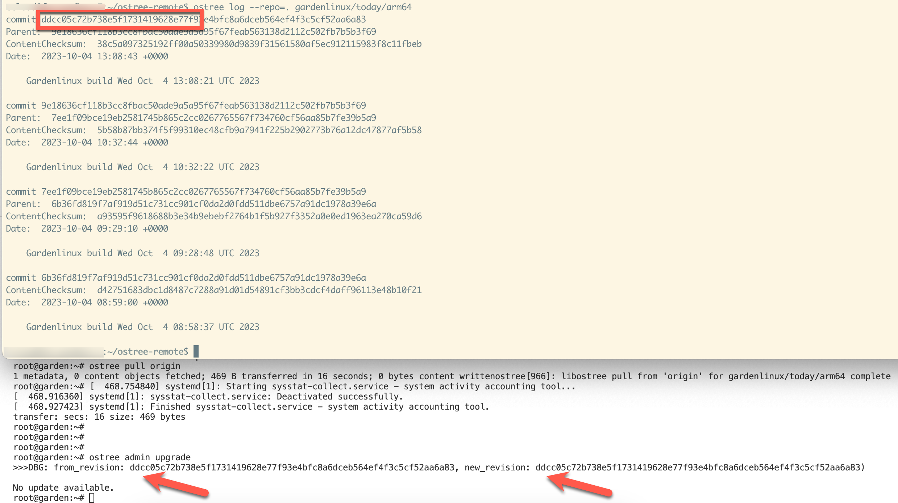
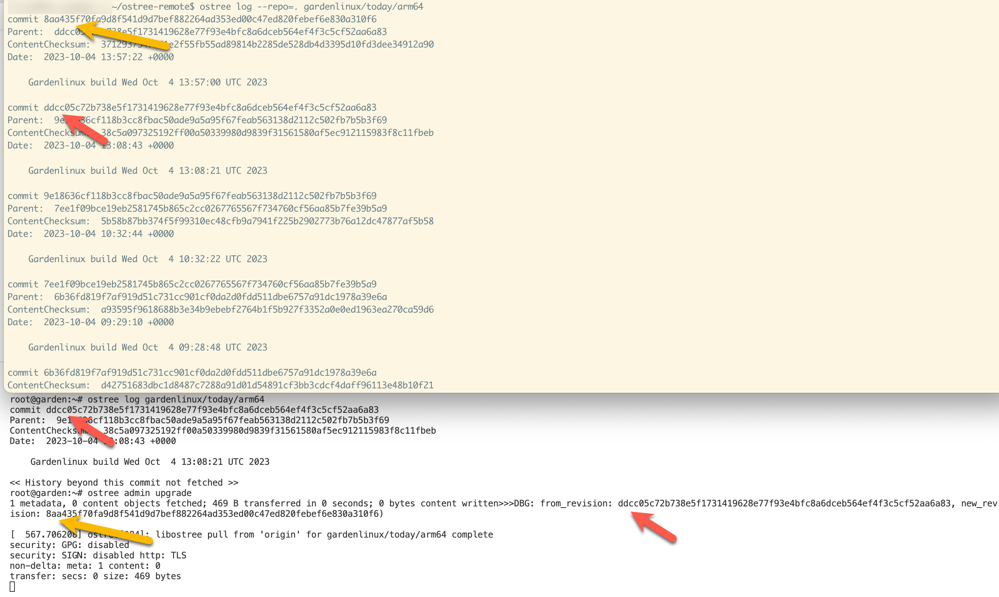
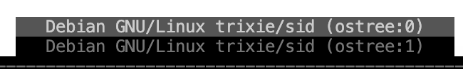

<!-- Title: Upgrades are hard (not really) -->

> This post is part of a blog post series on my Garden Linux fellowship. \
> See the [introductory post for context](https://blogs.sap.com/2023/07/10/making-an-immutable-image-based-operating-system-out-of-garden-linux/).

In this blog post series, I'm reflecting on my fellowship in the Garden Linux team.
The project I've picked in my fellowship is to see how [OSTree](https://ostreedev.github.io/ostree/) can be used with [Garden Linux](https://gardenlinux.io/).

I have divided my fellowship project into three larger milestones:

1. Get a booting system
2. Implement upgrade
3. Have some sort of 'package manager'

Milestone one (booting system) was achieved in [part 2](https://blogs.sap.com/2023/08/07/onboarding-to-the-garden-linux-team-getting-hands-dirty-with-ostree/) and [part 3](https://blogs.sap.com/2023/08/25/systemd-and-ostree-the-chase-is-better-than-the-catch/) of this series.

In this post, we'll investigate milestone two: How can we upgrade our OSTree-based Garden Linux systemd?
Upgrades are [a key-feature of OSTree](https://ostreedev.github.io/ostree/atomic-upgrades/).

Upgrading my system should be easy now, right?
That's what I was thinking, not knowing what would come in the following weeks.

Upgrading OSTree systems is conceptually similar to a `git pull`.
Like in git, OSTree has the concepts of _commits_ and _remotes_.

To create a remote, we need to save the commit we created in our pipeline and serve it via http.
Now the OSTree client can pull files from our remote.
Our remote is a HTTP server, and the server logs tell us that the files are being served.
This looks good!



Perfect, seems like everything is working.. except.. No. It is not.
We can _pull_ the data, but once we try to perform the upgrade we get an error.



Actually, investigation shows that every `ostree admin` command fails with the same error.
This is a problem I've not been aware before.

We can see in the error message that an [_assertion_](https://en.wikipedia.org/wiki/Assertion_(software_development)) is failing.
Assertions in programming are things that an user typically should not see.
Developers put assertions into their code to make sure that certain assumptions about their program or the data they are working with are true, and if they are not true the program crashes.
This is what happened here.
OSTree has a variable called `loadstate` and it expected this to have the value `OSTREE_SYSROOT_LOAD_STATE_LOADED`, but it had a different value for some reason.
But why?
What is `loadstate` even about?

As a user of OSTree, I don't know about `loadstate`.
It's not mentioned somewhere in the documentation.
Thankfully, OSTree is an open source project so I can dig into the source code.

What can we find out by searching the source code?

[`loadstate`](https://github.com/ostreedev/ostree/blob/befd84436cab510efe5f09acbe96dea49eb0fdcb/src/libostree/ostree-sysroot-private.h#L71) is a variable in the `OstreeSysroot` object and has an enum type.
Enum types (enumerations) are types that can have a few named values.
In the case of `loadstate`, the values are `LOAD_STATE_NONE`, `LOAD_STATE_INIT` and `LOAD_STATE_LOADED`.

We get an error because we're not in the `LOAD_STATE_LOADED` state.
At what point would this be supposed to be happening?

When searching for that in the code, we can see that this value is [only assigned in one single place](https://github.com/ostreedev/ostree/blob/befd84436cab510efe5f09acbe96dea49eb0fdcb/src/libostree/ostree-sysroot.c#L1209) inside the function `sysroot_load_from_bootloader_configs`.

But from where is this function called?
I've created the following graph in trying to understand where this call could happen, but this did not help me immediately.



As you can see there are quite a few ways how we can get to `sysroot_load_from_bootloader_configs`.
At this point, I was stuck for quite some time.
I did open an [issue](https://github.com/ostreedev/ostree/issues/3022) in the OSTree GitHub repo where I summarized what I knew about the issue, but that did not get any answer for a few weeks.

I suspected various root causes for the issue, most notably the bootloader and the deployment.
Why did those seem possible culprits?

## The Bootloader

One of those suspected causes is the boot loader.
Garden Linux uses systemd-boot which is not yet supported by OSTree.
I had this suspicion because the function is called `..load_from_bootloader_configs`, so it might make sense that this is something that works with supported bootloaders, but does not work with unsupported bootloaders such as systemd-boot.
I could not really find any evidence to support this suspicion.

## The Deployment

Another suspicion is that something was wrong with how I make the OSTree deployment.

To understand what this means, let's consider the following diagram explaining the various steps involved with creating the bootable OSTree image:



If you are familiar with git, some of the terms and concepts will be familiar for you.
Let's see what the individual steps mean.

I'll walk through a simplified example of this process and we'll look what happens in each step.

First, we'll initialize the repository:

```
$ ostree init --repo=sysroot/ostree/repo
$ find .
./sysroot
./sysroot/ostree
./sysroot/ostree/repo
./sysroot/ostree/repo/tmp
./sysroot/ostree/repo/tmp/cache
./sysroot/ostree/repo/extensions
./sysroot/ostree/repo/state
./sysroot/ostree/repo/objects
./sysroot/ostree/repo/refs
./sysroot/ostree/repo/refs/remotes
./sysroot/ostree/repo/refs/heads
./sysroot/ostree/repo/refs/mirrors
./sysroot/ostree/repo/config
```

This gives us some directories that very much look similar to an empty git repository.
We have `refs`, `remotes` and `objects`.

Next we'll initialize the operating system.
Our operating system needs a name, in this example I've called it `florians-linux`.
In this case, this is just a name that is being used to identify the operating system.
In theory it is possible to have multiple operating systems in one OSTree systems, but I've not yet seen such a system in practice.

```
$ ostree admin os-init --sysroot=./sysroot florians-linux
ostree/deploy/florians-linux initialized as OSTree stateroot
$ find .
./sysroot
./sysroot/ostree
./sysroot/ostree/deploy
./sysroot/ostree/deploy/florians-linux
./sysroot/ostree/deploy/florians-linux/var
./sysroot/ostree/deploy/florians-linux/var/tmp
./sysroot/ostree/deploy/florians-linux/var/run
./sysroot/ostree/deploy/florians-linux/var/lib
./sysroot/ostree/deploy/florians-linux/var/lock
./sysroot/ostree/deploy/florians-linux/var/log
./sysroot/ostree/repo
(... same as before)
```

Next we'll need our root file system.
In this example I've only put a single file here.
In practice this will contain all your typical linux directories and files such as `/usr/bin/ls` etc.

```
$ find myrootfs
myrootfs
myrootfs/hello

$ cat myrootfs/hello
hello world
```

Given our root filesystem, we can create our _commit_ on a _branch_ (called `main` in this case, but that is not important):

```
$ ostree commit --repo=./sysroot/ostree/repo --branch main myrootfs
5118126d07d78cb482e2eaf32595bf5539d47799043c9df0cb562ee51cd0c704
$ find .
./sysroot
./sysroot/ostree
./sysroot/ostree/deploy
(... same as before)
./sysroot/ostree/repo
./sysroot/ostree/repo/tmp
./sysroot/ostree/repo/tmp/cache
./sysroot/ostree/repo/extensions
./sysroot/ostree/repo/state
./sysroot/ostree/repo/objects
./sysroot/ostree/repo/objects/6f/2069d6d37f8c490d5f5fe2e753cdf756479987103633fc8b938824f3008c8b.file
./sysroot/ostree/repo/objects/51/18126d07d78cb482e2eaf32595bf5539d47799043c9df0cb562ee51cd0c704.commit
./sysroot/ostree/repo/objects/79/4f9b8b314d4d57193fca37dab9149b075b598dadb39d33f77d6a815fca584c.dirmeta
./sysroot/ostree/repo/objects/dd/3365f444c0bfd86482c9d89c412abf503437fbca8e40103bee0da3119db252.dirtree
(... same as before)
```

This will create `objects`.
The types of objects are described [in the OSTree documentation](https://ostreedev.github.io/ostree/repo/#core-object-types-and-data-model) in case you are curious about more details.

In our case we only have one **file**, so let's look what that file contains:

```
$ cat ./sysroot/ostree/repo/objects/6f/2069d6d37f8c490d5f5fe2e753cdf756479987103633fc8b938824f3008c8b.file
hello world
```

Oh yeah, it is our `hello` file.

Now we can finally do the deployment:

```
$ ostree admin deploy --sysroot=./sysroot --os=florians-linux main
$ find .
./sysroot/ostree
./sysroot/ostree/deploy
./sysroot/ostree/deploy/florians-linux/deploy/aaa.0/hello
(... same as before)
./sysroot/ostree/repo/objects/6f/2069d6d37f8c490d5f5fe2e753cdf756479987103633fc8b938824f3008c8b.file
(... same as before)
./sysroot/ostree/boot.1.1/florians-linux/bbb
./sysroot/ostree/boot.1.1/florians-linux/bbb/0
```

The deployment is a copy of our root filesystem that can be booted into.
Why do we need deployments?
OSTree is built in a way that allows us to have "multiple copies" (commits) of our root file system locally.
If we have an os upgrade, and the upgrade breaks our system for some reason, we can revert the upgrade by booting into a previous deployment/commit.
The "multiple copies" I've mentioned are not really duplicated files.
A common approach to allow rollbacks of operating systems is the A/B partition approach where the operating system has two root partitions, and upgrades will always be applied to the partition that's currently not booted.

OSTree does follow a different, git-like approach.
Consider this picture:



Here we see the simplified visual representation of two commits `A` and `B`.
The hexadecimal number represents the sha hash of that file, showing us that some files are the same in both commits, some files have changed and some files are new in commit `B`.

Deployment is the process that OSTree uses to turn those commits into bootable Linux filesystems.
One deployment always corresponds to one commit.
We can select a deployment at boot time, which allows us to select what OS version we want to boot.

You can read more about OSTree [deployments here](https://ostreedev.github.io/ostree/deployment/).

Back to our failing assertion:
My suspicion was that the `write_deployments_finish` function that we've seen above should be called here and set the `loadstate` variable to `LOADED`.

At this point, with the suspicions I described, I've been stuck for quite some time.
I tried quite a few tools and methods to investigate the issue, but nothing seemed to help.

I was thinking about using a debugger to step through the code of the deployment to see what might go wrong, but as this code is running inside the Garden Linux Builder where I don't have an interactive terminal, this seemed hard or impossible to do.

At some point, I've decided to do other things and see if we could resolve that issue later.

# Those containers are made for booting

One thing that captured my attention are _boot containers_.
What are boot containers?

There is a GitHub repository at [containers/bootc](https://github.com/containers/bootc) which describes them like this:

> Transactional, in-place operating system updates using OCI/Docker container images.
> 
> The container image includes a Linux kernel (in e.g. `/usr/lib/modules`),
which is used to boot.  At runtime on a target system, the base userspace is
*not* itself running in a container by default.  For example, assuming
systemd is in use, systemd acts as pid1 as usual - there's no "outer" process.

This does sound interesting as people who start learning the differences between _containers_ and _virtual machines_ typically note that containers don't contain a kernel.
Containers use the kernel of the host machine.
Boot containers add a kernel to the image and use the container image as a means to transport and store the image.
Those containers can still be used as an application container, i.e. like a 'normal' OCI/Docker container, but they can also be used to boot the operating system.

I've taken two days to look into the `containers/bootc` source code repo in early September 2023 out of curiosity.
I would have liked to try out boot containers with Garden Linux, but once again systemd-boot seems to be something that's not yet supported with boot containers.
As Garden Linux does not contain GRUB there was no easy way to try it out, my general impression from reading the source code superficially is that bootc is in a pretty early stage which is also reflected in the hint in the project's README:

> `STATUS: Experimental, subject to change!`

I've stopped looking at boot containers for now, but I find the concept very interesting as OCI container images are much more versatile than 'just' running containerized applications.

# Plain debian vm

Next to my work in the Garden Linux github repository, I've also created a playground repository on GitHub which is based on the sample project for the [Garden Linux Builder](https://github.com/gardenlinux/builder#builder).

As opposed to the proper Garden Linux repo, this builds a 'plain' Debian vm, so it does not use the Garden Linux package sources.

My plan for this repository was to provide a simple example for how debian-based OSTree systems can be built, leaving out all the complications of the actual Garden Linux project.

As I had been looking for existing OSTree/Debian builder scripts before and found nothing that I could get working with a current version of Debian this might be interesting for a wider audience, I guess.

Feel free to check this repo out at [fwilhe/ostree-debian-builder](https://github.com/fwilhe/ostree-debian-builder) if you are curious.
It is still very rough, but it should give you a playground for getting up and running your own system if you want to do that.

# Resolving the assertion error

You might think that using a debugger would be an appropriate tool to investigate why that assertion is going wrong.
I have to admit that I don't have any experience with debugging c applications.
I know that they can be compiled with debug symbols and that typically for production use this is not the case.
This does not make it impossible but harder to debug.
My experience with debugging is limited to languages like Java or Go, in an IDE.
I know about GDB, but compiling a version of OSTree with debug symbols to step trough the code in GDB did sound like too much effort to me.
Also, since I was suspecting the actual issue might happen inside the image build process which is non-interactive anyway using GDB might have been impossible, I'm not sure about that.

So what's the next best thing when you're too lazy or not able to use a debugger?

`printf()` debugging of course.

I've added various print statements, rebuilt OSTree and tried running that.

That's how I found out that actually the issue does not happen while (a) _building the image_ or (b) _booting_ as I was suspecting, but actually when running the `ostree admin upgrade` command.

What is happening is that inside the code that leads to the `loadstate` being set, there is an early return when some timestamp comparison is true.
This early return prevents our `loadstate` from being set to the required value, causing the assertion to fail.
I could not make much sense of that timestamp comparison, but a OSTree contributor helped me figure it out in the GitHub issue.

Let me explain:

In Garden Linux, it is important for us to create _reproducible_ disk images.
That is when I'm building the same version of Garden Linux twice, I want to end up with the identical disk image.
There are many factors that make reproducible builds hard, one of them are timestamps.
When I create the same disk image twice, it will get different timestamps.
That's why the Garden Linux build uses a constant timestamp for each version, so rebuilding the same version will produce the same image twice.

What I had not been aware of is that I did not set the timestamp, so the Garden Linux builder used a timestamp value `0`, which is equivalent to January 1st, 1970.



I did not think this could be an issue, but yes it is because that timestamp comparison that leads to the early return assumes your disk image has a non-`0` timestamp.


Screenshot taken from [the `ostree_sysroot_load_if_changed` function](https://github.com/ostreedev/ostree/blob/67ccf6e0a1089a2a9546b267a600cbab59a4491c/src/libostree/ostree-sysroot.c#L1248).

Wow.

So the fix was easy.
I can supply any constant non-`0` value to the Garden Linux builder, and there we go:
We don't run into this assertion error.

You can have a look at how that unfolded in the mentioned [issue on GitHub](https://github.com/ostreedev/ostree/issues/3022), if you are interested.

Retrospectively, I think I can say that using a debugger to solve this might have been the easier way.
I was trying to understand what goes wrong, and I had very incomplete information about the assumptions that went into that code.

# Making the upgrade work

With the assertion fixed, I still faced some minor issues with the upgrade process.
The OSTree CLI claimed it could not find any upgrade, when clearly my remote had an update available.
The bootloader entries where not updated by OSTree (because they don't support systemd-boot).
And while booting the updated commit, OSTree complained it could not find a `sysroot` directory. This is an issue I was already familiar with from a few weeks ago when making the initial proof of concept work.

For now, I've resorted to create a small and hacky shell script that does a workaround for the mentioned issues.
Using this script, it's possible to boot a disk image with an OSTree-based system, pull an updated commit from a remote, reboot the system and get the upgraded OS image.

In this screenshot, you can see two terminal windows.
Above is my server that's providing the OSTree remote.
It has multiple commits.

In the lower section, you can see the vm that's booted from the most recent commit.
It tries to perform an upgrade, but it correctly finds that no upgrade is available because `ddcc0` is the most recent commit.



In this screenshot, you can see that a newer commit exists on the remote repository: `8aa43` which OSTree correctly identifies.
See the color coded arrows pointing at the different commit ids:



Manually updating our systemd-boot entries then allows us to boot the new commit.



This is similar to what we've seen in the [first part of this series](https://blogs.sap.com/2023/07/10/making-an-immutable-image-based-operating-system-out-of-garden-linux/) with the Fedora Silverblue boot screen.

This was a wild ride, but I've learned a lot.

# Next items to work on

I have a few things I'm working on next:

I want to put daily builds of the Garden Linux OSTree image somewhere so existing systems can upgrade from an actual remote.
My remotes so far all had been simple local HTTP servers, nothing available on the internet.

On OSTree-based systems, [Container Toolbox](https://containertoolbx.org) is a useful tool to make it easier to get temporary containers to work in.
Toolbox is a wrapper for podman and makes some things more simple to do like exposing ports from the container or mounting a directory from the host into the container.
I'd like to explore if it makes sense to build a custom toolbox container image based off the Garden Linux packages, or if it is sufficient to use any other Linux distribution which has images available.

I also want to look into [systemd-sysext](https://www.freedesktop.org/software/systemd/man/systemd-sysext.html) which might also be a helpful tool for getting temporary mutable environments in OSTree-based systems.

So, you see, I'm not done yet.
Stay tuned for the next update in this series.

> If you're interested in the topic, feel free to comment this blog post or reach out to me on [LinkedIn](https://www.linkedin.com/in/fwilhe/).
