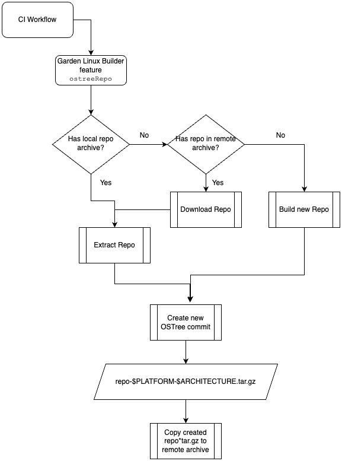
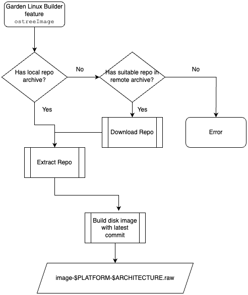
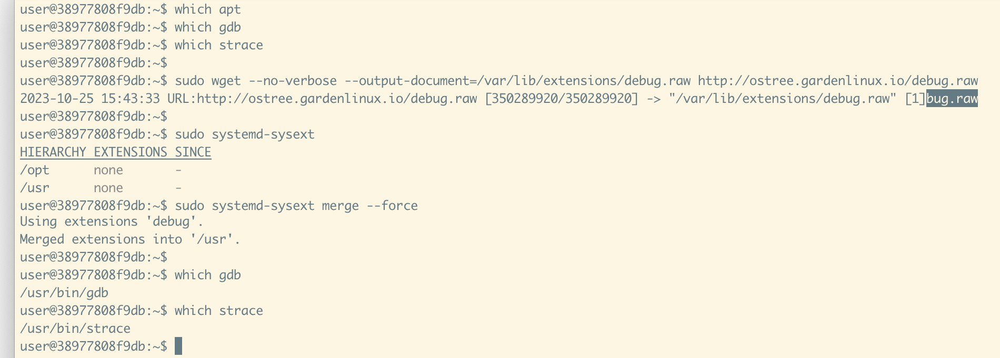

Title: Putting the Pieces together

> This post is part of a blog post series on my Garden Linux fellowship. \
> See the [introductory post for context](https://blogs.sap.com/2023/07/10/making-an-immutable-image-based-operating-system-out-of-garden-linux/).

# New Proof of Concept git Repo

I'm happy to share that the OSTree on Garden Linux proof of concept has it's own proper GitHub repository now:


**Get the code at [github.com/gardenlinux/ostree-image-builder](https://github.com/gardenlinux/ostree-image-builder)**.

It contains code for building both Garden Linux and Debian images.
I think this might also be interesting for people who don't contribute to Garden Linux.
In my research phase at the beginning of my fellowship, I was looking for Debian (or Ubuntu)-based OSTree systems and while I did find a few scripts to create such images, none of them was working for me with recent versions of Debian Testing.
This repository might be a good starting point for anyone who is interested in building a Debian-based OSTree image, or who wants to learn how to work with OSTree in general.

Note that this is **experimental** and not in any way officially supported by the Garden Linux team.
Feel free to star, clone and fork the repository, and create issues and pull requests if you find issues or want to contribute.
Depending on the evaluation of the proof of concept, this repository might be archived and become read-only in the near future.

# Upgrade workflow

In the [last blog post in this series](https://blogs.sap.com/2023/10/10/upgrades-are-hard-not-really/), we enabled the OSTree upgrade feature.
Now let's look at how we can build and serve the _repository_ we need for OSTree.

Like in git, most OSTree commits have _parent_ commits.
Also like git, OSTree supports _branching_, but we'll ignore that for now as this is not relevant for our use-case.
We'll just assume commit history to a list.

We can look at our commits using the `ostree` cli where we can see how commits reference their parent, if they have one:

```
$ ostree log debian/testing/amd64
commit 5e19ec6cf207f723f29b6e64c866f8643d70ba4884f1b23f42d36ac900a1d7eb
Parent:  0c3d1ecfbc6aa4b34875f7cd16eaa05009772aaedd0efc74da6d3124165f4ce8
Date:  2023-10-10 15:42:57 +0000
    Commit B

commit 0c3d1ecfbc6aa4b34875f7cd16eaa05009772aaedd0efc74da6d3124165f4ce8
Date:  2023-10-10 13:25:34 +0000
    Commit A
```

Commit `A` has no parent, it is the first commit in the repository.
Commit `B`, and all that will follow do have a parent commit.

## OSTree Repo

When running our `ostreeRepo` build step, we need the existing repository so our new _commit_ properly can use the latest previous commit as it's _parent_.

If we can't provide our existing repository as input to the `ostreeRepo` build step, we would always create repositories with only one commit and would not be able to implement a smooth upgrade process using OSTree.

For the purpose of this proof of concept, the OSTree repositories are served from `ostree.gardenlinux.io`.
We'll describe this as the _remote archive_.
It contains OSTree repositories both as tar archives and as extracted directories.
The tar archives are used for the builder, and produced by the builder, the extracted directories are used as a remote for running systems.

The builder will check if the repo file exists locally, which is useful for development as it can avoid unneeded downloads.
In case it can't find a local version of the repo, it will download it from the remote archive.

The workflow roughly looks like this:



This provides us with a workflow where we can build new commits and have them in our repository.
The repository gets a continuous history, which is exactly what we need.

## OSTree Image

Next, we can have a second build step in our builder which creates a bootable disk image based on a previously generated repository:



The `ostreeImage` build step checks for a local copy of the repo, and if it can't find one it downloads the `repo.tgz` artifact and deploys the latest commit in our disk image.

This will give us a disk image that contains the latest commit only, so we don't needlessly ship all of the commit history with our disk image.
This is much different from git where the default is to get the full commit history in a local clone.

Once that image is booted, and a newer commit is available in the remote repository, we can upgrade that system.
The url to our remote repository is configured as part of the image.
The user might, if they want, change that remote url if they are hosting their own remote repository.

The `ostree admin upgrade` command will query the remote repository and identify newer commits.

# Poor Man's Package Manager

So now we have a system that we can _boot_ and _upgrade_.
But that's still only the base operating system.
It does not do anything useful on its own.

What if we want to run software on it?

There are multiple options, let's take a closer look at them.

## Option 1: Containers

Our base image contains [podman](https://podman.io) for running _containers_.
We might also include other container runtime engines if needed.

Suppose we want to run some web application.
It might need some language runtime such as a JVM or Python.
It might need some application or web server such as NGINX.
It might need a database engine such as PostgreSQL.

All those needs should be satisfied with containers.
This provides nice isolation as the application can declare its own dependencies, and if we run multiple applications which might require different versions of a certain runtime we can satisfy those needs without conflicts on our host system.

Using [podman compose](https://docs.podman.io/en/latest/markdown/podman-compose.1.html) or [podman play kube](https://docs.podman.io/en/latest/markdown/podman-kube-play.1.html) we can also automate setups that require multiple containers, for example when an application is split into multiple services.

### Toolbox

[Container Toolbox](https://containertoolbx.org) might also be useful.
It is intended for ephemeral (short-lived) environments on immutable systems.
Essentially, it is a wrapper for using containers in a more convenient way.
It's purpose is not to run containers in production, but rather to provide a toolkit for developers and operations to work with image-based systems that might be lacking the debugging tools needed for a specific task.

## Option 2: Custom package system

In Fedora Silverblue or Fedora CoreOS, you can use [rpm ostree](https://coreos.github.io/rpm-ostree/).
It is described as a "hybrid image/package system".
This allows you to "install" packages similar to a package-based system, but what actually happens is different.

It does not really "install" packages, but it downloads a diff-layer that contains what the package contains and merges this into your filesystem.

The OSTree docs describe how to implement such a system in theory in ["writing a buildsystem and managing repositories"](https://ostreedev.github.io/ostree/buildsystem-and-repos/).

This could be done using the APT package manager used by Debian, too.
Implementing such a system seems out of scope for this proof of concept.
There seems to be an [existing open source implementation of 'apt-ostree'](https://opendev.org/starlingx/apt-ostree), but I have not yet taken a closer look at it.

## Option 3: System extensions

Another really interesting approach are [_system extensions_](https://uapi-group.org/specifications/specs/extension_image/#sysext-system-extension).
They are implemented as part of the systemd project and much like rpm-ostree allow to _merge_ programs into the _immutable_ linux file system below `/usr`.

A good introduction to the concept was given by [Kai Lüke](https://github.com/pothos) in his talk [_Deploy software with systemd-sysext - Introduction to OS extensions with sysext images_](https://programm.froscon.org/2022/events/2775.html) at FrOSCon 2022.
See the [recording of the talk here](https://media.ccc.de/v/froscon2022-2775-deploy_software_with_systemd-sysext), I can highly recommend it.

Essentially, system extensions can exist both as a directory or as a disk image file.
They contain some meta data and the application binaries and libraries needed to run any program.
For programs written in go for example, creating system extensions is typically quite simple as go programs often don't need any specific shared libraries.

A system extension for a program written in go can be as simple as this directory hierarchy:

```
hello
└── usr
    ├── bin
    │   └── hello (compiled go program, statically linked binary)
    └── lib
        └── extension-release.d
            └── extension-release.hello (text file containing meta-data)
```

Once this extension is _merged_, the `hello` program will be available as `/usr/bin/hello`.

Dropping in a single go binary is not that impressive and does not quite justify the complexity of system extensions.

The real strength of this approach starts where applications are a bit more complex, for example if our `hello` program was a backup tool that needs to run on a regular schedule.
Our system extension may contain systemd unit files such as a [timer](https://www.freedesktop.org/software/systemd/man/latest/systemd.timer.html) that allows our backup program to run as needed.

System extensions allow us to package the binary, any needed libraries and auxillary files such as systemd units in a neat package that can be easily downloaded and _merged_ into the filesystem.

More complex system extensions can be built using [mkosi](https://github.com/systemd/mkosi). 
As an example, let's take debugging tools.
The images we're building as part of this PoC don't contain tools like `gdb` or `strace`.
Those tools typically are not needed for the purpose the images are built for, so that's how it should be.
But what if I need any of those tools for debugging or investigating any issue?

I can build a system extension.
Doing that manually would be quite an effort because figuring out the right libraries the extension needs is quite a complex task.

Thankfully mkosi can do this for us.
It allows us to create a disk image that only contains the files that are added by installing certain packages.
I've created a `debug.raw` image that contained `gdb` and `strace`.
We can download the image file and _merge_ it into our root file system, giving us what we need: Access to the `gdb` and `strace` cli tools.



Really cool.

Compared to rpm-ostree this approach has a few shortcomings, for example we manually need to copy/download the `.raw` file to our host to "install" it.
But for the proof of concept, this seems to be good enough for now.

# Summary and next steps

todo


> If you're interested in the topic, feel free to comment this blog post or reach out to me on [LinkedIn](https://www.linkedin.com/in/fwilhe/).
