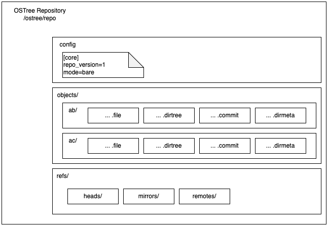
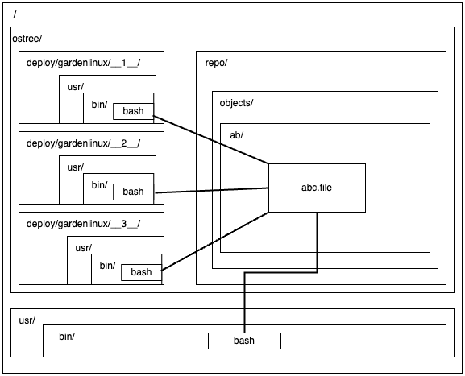
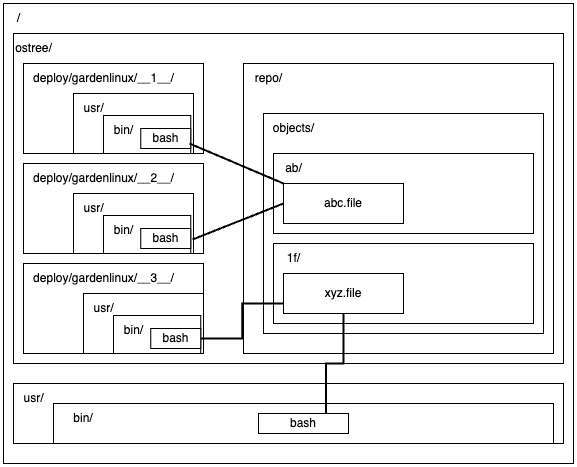
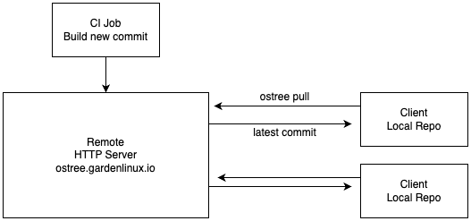
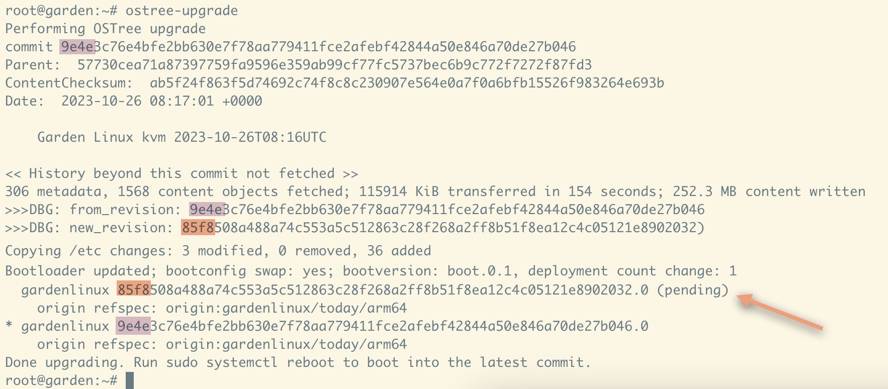
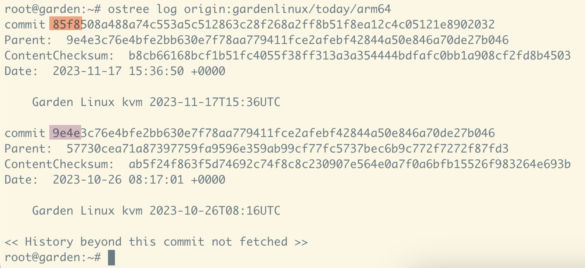
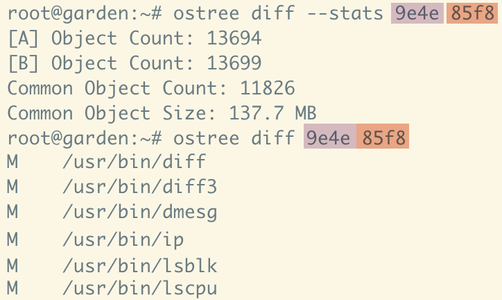

<!-- Title: Retrospective -->

> This post is part of a blog post series on my Garden Linux fellowship. \
> See the [introductory post for context](https://blogs.sap.com/2023/07/10/making-an-immutable-image-based-operating-system-out-of-garden-linux/).

My fellowship is coming to an end and I'd like to use this blog post to summarize my learnings and discuss future potential.

I have already explained what OSTree does in the first post of this series, but as my understanding has improved during the last months, I'd like to do another take on that.

# How does OSTree work

OSTree-based operating systems have a local _repository_.
This is by design quite similar to a git repository.
The repository contains our commits, files, directories and metadata.
Typically this is located at `/ostree/repo`.

Our repo roughly looks like this:

The files that are part of our image (i.e. our linux root filesystem) are stored inside the `objects` directory, addressed by their sha256 sum.
Assuming we have three commits/deployments on our local machine and all of them contain the same version of `bash`, we will only have a single copy of the `bash` binary in our system, identified by its sha sum.
On boot, depending on which deployment we select, the root filesystem represented by one commit will be mounted as the root filesystem.
In this example, for `bash` we will get the exact same binary, but for other files there will be different versions.

Assuming we get a new commit/deployment `__3__` which contains an updated version of bash this will result in a new binary file with a different sha sum.
When we're booted into the `__3__` deployment, we will get the newer version of bash, if we for some reason need to boot an older commit we would also get the older version of bash again.

Like git, OSTree has the concept of remotes.
Unlike git, typically we won't compose new commits on our local machine, but they will be created by a CI job.
New commits will typically include an updated version of our root-filesystem providing us with security updates and other fixes.
Our local repositories will be updated from that remote.
The new commits will be pending until our clients reboot for the next time, which is when the new commits will automatically be booted and our system is updated.

This is how performing an upgrade looks on the command line.
You can see that our system starts with a single commit `9e4e`.
Our remote has a new commit `85f8` available.
The newer commit is being downloaded and deployed.

We can see the parent/child relationship between those commits when looking at the log.

And we can inspect which files have been changed, added or deleted between both commits.
This might be useful when we need a Software Bill of Materials (SBOM) for our nodes, for example if a new security issue becomes public and we want to be sure all our running nodes have the patched version of some component in use.

On the next reboot, the new commit `85f8` will be booted by default and our system is updated.

## Recommended resources

I found the following resources helpful in explaining this, and some of my drawings have been inspired by the slides:

- [Securing device updates with OSTree Webinar by Toradex](https://www.youtube.com/watch?v=jYscnrpyB9Y&t=170s)

- [Ostree for the Uninitiated - What You Need to Get Up and Running with Ostree on Your Next Project - Davis Roman, Lucid Motors](https://www.youtube.com/watch?v=_CwGUt0CpvU)

# Build your own OS based on the Proof of Concept

Image-based systems are (naturally) limited in how customizable they are.
For example, if you were interested in using the images I've built as part of this project, you are limited by the selection I've included in the images.
This might work for your use case, but most likely you'd have some other requirements.

To solve this, you can build your own OSTree repo and disk image with customized settings.
This allows you to host a custom remote repository and be independent of the Garden Linux provided repo.

To do so, you'll need to set the following variables before building your repo and disk image:

| Variable     | Default Value                  | Explanation                                                                                                                       |
| ------------ | ------------------------------ | --------------------------------------------------------------------------------------------------------------------------------- |
| `REMOTE_URL` | `http://ostree.gardenlinux.io` | This is the hostname part of the URL of your remote repository. Set this to a hostname you control and where you can up the repo. |
| `OS_NAME`    | `debian` or `gardenlinux`      | This is the name of your OS. This will be used as an identifier by OSTree.                                                        |

The full process to build your own system [is documented on GitHub](https://github.com/gardenlinux/ostree-image-builder/blob/main/docs/build-your-own-os.md).

# Potential future improvements in the Proof of Concept

My goal for the course of the fellowship was to see how a OSTree-based Garden Linux system can be built and which benefits this might provide.
This goal is achieved and the result is available as open source software [on GitHub](https://github.com/gardenlinux/ostree-image-builder) and I'm really happy with the outcome.

As with every project, there are multiple possible extensions of the scope.
Those are the ones that seem plausible to me:

- [Image variants for cloud providers (aws, azure, gcp and others)](https://github.com/gardenlinux/ostree-image-builder/issues/9)
- [Fix failed systemd units at boot](https://github.com/gardenlinux/ostree-image-builder/issues/8)
- [Implement Garden Linux "features" using system extensions](https://github.com/gardenlinux/ostree-image-builder/issues/10)
- [Try OSTree-based Gardener deployments](https://github.com/gardenlinux/ostree-image-builder/issues/11)
- [Make disk images smaller](https://github.com/gardenlinux/ostree-image-builder/issues/7)

Feel free to comment on any of those issues, or maybe even contribute a PR addressing any of them if you want.

# Reflection

This is the last post of this series as my fellowship is coming to an end.
I'd like to thank everyone who supported me in doing this, it has been a great experience and I'm really grateful that I got the chance to do it.

I will continue working on Garden Linux and write blog posts when there are interesting topics.

> If you're interested in the topic, feel free to comment this blog post or reach out to me on [LinkedIn](https://www.linkedin.com/in/fwilhe/).
